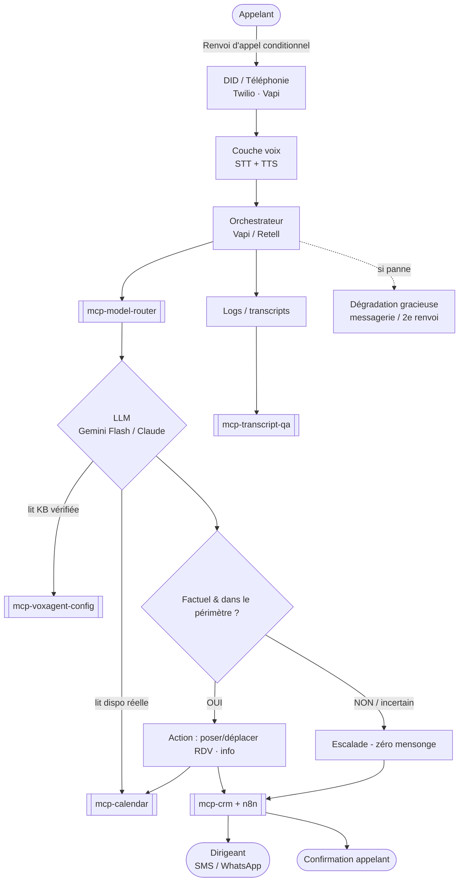
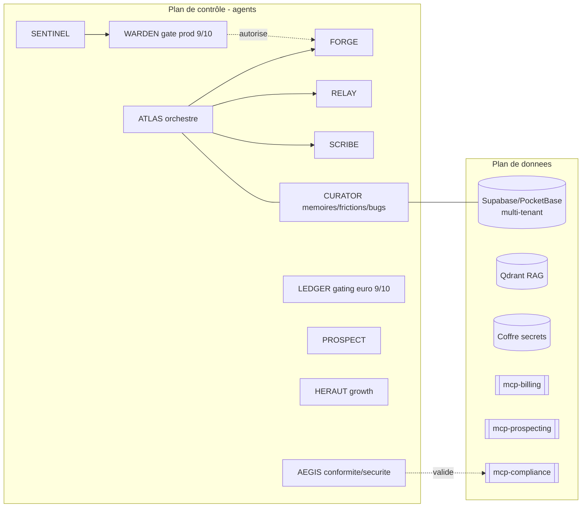

# Topologie du système VoxLocal

> Vue d'ensemble pour reprise/débogage par un tiers. 3 plans : appel (runtime), contrôle (agents), données. Source Mermaid ci-dessous (éditable/versionnable).

## Plan d'appel (runtime) — le flux à déboguer en priorité

## Plan de contrôle (agents) & plan de données

## Légende des points de rupture probables (pour le débogueur)
1. **Renvoi d'appel** mal configuré côté opérateur → l'IA ne reçoit rien.
2. **DID / provisioning** non validé (SIRET) → numéro inactif.
3. **OAuth agenda** expiré → dispo illisible → fausses promesses (à bloquer).
4. **mcp-model-router** : mauvais modèle/latence → coupures.
5. **Garde-fou KB** : tarif hors base → DOIT escalader, jamais inventer.
6. **Panne stack** → la dégradation gracieuse doit reprendre la main.
